## 📈 GitHub Contributions

  

  

  
  

## 🐍 Contribution Activity

  <picture>
    <source
      media="(prefers-color-scheme: dark)"
      srcset="https://raw.githubusercontent.com/developer-web-ops/developer-web-ops/output/github-contribution-grid-snake-dark.svg"
    />
    <source
      media="(prefers-color-scheme: light)"
      srcset="https://raw.githubusercontent.com/developer-web-ops/developer-web-ops/output/github-contribution-grid-snake.svg"
    />
    
  </picture>

### 🧩 Contribution Focus

<table align="center">
  <tr>
    <td align="center" width="25%">
      <strong>🤖 AI / ML</strong> 
      Machine Learning 
      RAG · AI Agents · NLP
    </td>
    <td align="center" width="25%">
      <strong>☁️ Cloud</strong> 
      Cloud Engineering 
      Deployment · APIs · CI/CD
    </td>
    <td align="center" width="25%">
      <strong>⚙️ Backend</strong> 
      Java · Python 
      Spring Boot · REST APIs
    </td>
    <td align="center" width="25%">
      <strong>🔬 Engineering</strong> 
      Testing · Automation 
      Developer Tools
    </td>
  </tr>
</table>

### 🚀 What I'm Building

- 🧠 AI/ML systems with practical real-world applications
- 🔎 RAG-based applications with grounded retrieval
- 🤖 AI agents for software engineering automation
- ☁️ Cloud-native APIs, deployment and CI/CD workflows

  

